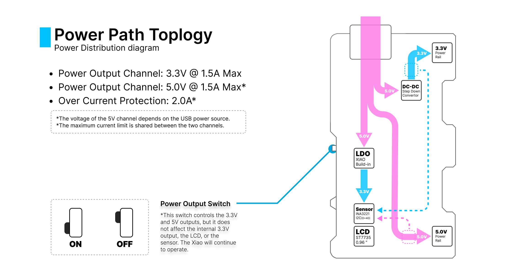

# Getting Started with XIAO - PowerBread

## Introduction and Key Features

**XIAO PowerBread** is an open-source hardware project that revolutionizes breadboard prototyping with its reliable and efficient power solution. This compact powerhouse combines:

- Dual voltage rail with high-current output: Delivers up to 1.5A of 3.3V power and offers 5V output, providing versatile power options suitable for most breadboard projects.
- Dual channel Real-Time Monitoring: Built-in sensors provide instant feedback on voltage, current, and power.
- Built-in LCD Display: Clear, real-time visualization of power metrics with multiple UI functions including data monitoring, line charts, and statistics modes.


## Specifications

- **Microcontroller**: works with **Seeed XIAO RP2040**
- **Display**: 0.96" 160x80 TFT LCD
- **Power Output**: Up to 1.5A (3.3V and 5V)
- **Power Measurement**: Powered by INA3221 on I2C bus(0x40)
- **Current Sensing Range**: 0mA - 3600mA @ 1.0mA resolution
- **Voltage Sensing resolution**: 0.001V
- **Over Current Protection**: 2.0A


## Getting Started

### Hardware Setup

1. Unpack your Seeed XIAO RP2040
2. Solder the pin header on the XIAO 
3. Install the XIAO to the PowerBread Board (Make sure the orientation as shown in the product picture)
4. Download the latest firmware to XIAO RP2040 from the [Release page](https://github.com/nicho810/XIAO-PowerBread/releases)
5. Power the device via the USB port of XIAO, and start to play with it!

> When soldering the XIAO pin header, it's recommended to use the short pin header included in the XIAO PowerBread package for a more compact design. However, if you plan to use the XIAO for other projects as well, you can opt for the longer pin header for versatility.

> **Note**: All power is supplied through the USB port of the XIAO. Ensure that the power source for the XIAO can provide sufficient power for your project. Typically, a PC's USB port can supply up to 500mA. For projects requiring more power, consider using a USB power bank or a 5V 2A power adapter.

### Software Setup

#### 1. Directly use the firmware
To quickly get started with XIAO PowerBread, you can use the pre-compiled firmware. Follow these steps to upload it using the UF2 method:

1. Download the latest compiled firmware file (*.uf2) from the [Release page](https://github.com/nicho810/XIAO-PowerBread/releases).
2. Connect your XIAO to your PC or Mac using a 4-pin USB cable.
3. Enter bootloader mode:
   - Press and hold the B (Boot) button on the XIAO RP2040.
   - While holding B, press the R (Reset) button and release it.
   - Release the B button.
4. Your PC/Mac should detect a new USB drive named "RPI-RP2".
5. Drag and drop the downloaded firmware file (*.uf2) onto the RPI-RP2 drive.
6. The file will automatically upload to the XIAO. After a few seconds, the XIAO will reset and boot into the new firmware.

Note: If you encounter any issues during this process, ensure you're using a proper data-capable USB cable and that your XIAO is functioning correctly.

#### 2. Build your own firmware

1. clone the github repository or download the zip file
```
git clone https://github.com/nicho810/XIAO-PowerBread.git
```

2. go to the firmware folder
```
XIAO-PowerBread/Firmware/XIAO-PowerBread-Firmware
```

3. open the .ino file with Arduino IDE 2.0 or later
4. download the XIAO RP2040 board on Arduino IDE if you haven't install it yet (Must use the "Raspberry Pi Pico/RP2040/RP2035" by Earle Philhower, not the official "Arduino Mbed OS RP2040 Boards")

5. download the required libraries on Arduino Library Manager
- INA3221_RT Library
- Adafruit GFX Library
- adafruit sleepydog

6. Modify the code if needed.

### Operation

#### 1. Universial output switch


> Slide the power output switch to the down position to enable the 5V and 3.3V power output. This switch is only for power output,the LCD and sensor will keep working.

#### 2. Switch Mode


> Short press the dial to switch the mode

#### 3. Switch Channel


> When in Line-Chart and Statistics mode, long press the dial to switch the channel

#### 4. Rotate the dial


> Rotate the dial to adjust the UI for different viewing angles in any mode

### Resources

- [Schematic](https://github.com/nicho810/XIAO-PowerBread/blob/main/PCB/v1.2/Schematic_v1.2.pdf)
- [Datasheet](https://github.com/nicho810/XIAO-PowerBread/tree/main/Datasheet)
- [GitHub](https://github.com/nicho810/XIAO-PowerBread)
- [Firmware](https://github.com/nicho810/XIAO-PowerBread/releases)
