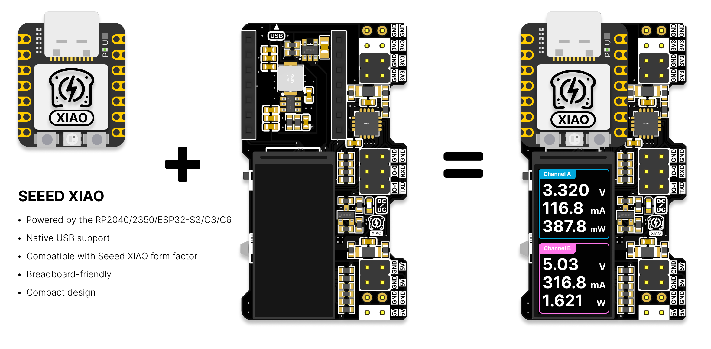
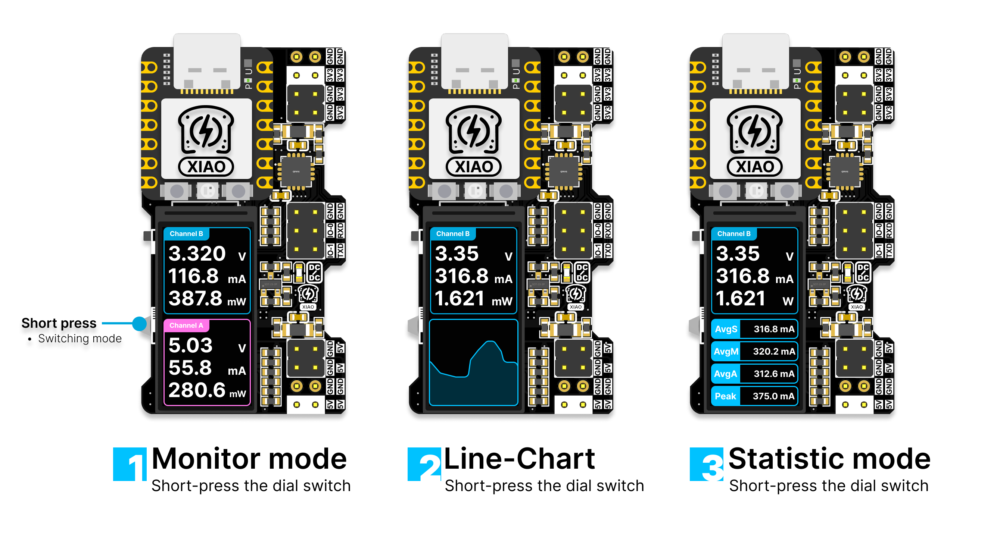
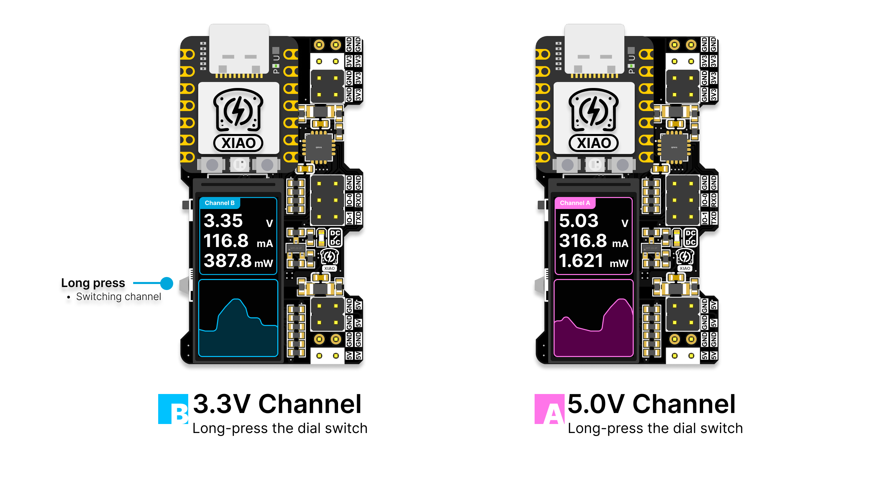
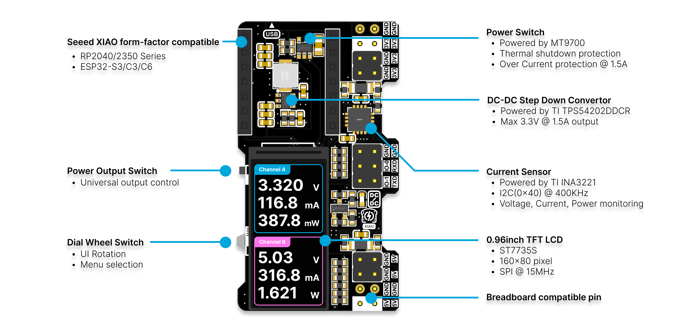

# XIAO PowerBread - A Breadboard Power Supply with Real-Time Monitoring

English | [日本語](README_JP.md)

**XIAO PowerBread** is an open-source hardware project designed to offer a reliable and efficient power solution for breadboard prototyping. Featuring built-in sensors, real-time monitoring, and the RP2040 microcontroller, PowerBread makes powering and developing electronics projects easier than ever.

> Easy installation and compact design

> Direct power and monitoring you breadboard projects

## Key Features

1. **Real-Time Monitoring**: View essential power metrics at a glance—no multimeter needed. The built-in display shows real-time voltage, current, and power data.
2. **High-Current Output**: Deliver up to 1.5A of 3.3V power, ideal for most breadboard-based electronics projects.
3. **Built-in LCD Display**: Stay informed with real-time feedback—critical power data is displayed clearly on the integrated LCD.
4. **Plug-and-Play Design**: Compatible with standard breadboards, simply plug in, power up, and start prototyping without extra setup.
5. **Open-Source and RP2040 Powered**: Powered by the RP2040, this open-source design provides flexibility for future extensions like USB-serial communication and PWM control.
6. **Dual-Channel Voltage and Current Sensing**: Equipped with the INA3221 sensor for dual-channel voltage and current monitoring—know what’s happening with every aspect of your power supply.
7. **Compact Powerhouse**: This compact design delivers both 3.3V and 5V outputs, optimizing your breadboard space without compromising on power.
8. **Multiple UI functions**: The UI can be switched between data monitoring, line chart, and statistic mode.

> Multiple UI functions

> Long press the dial to switch channels in chart and statistic mode

> Rotate the dial to adjust the UI for different viewing angles

## Hardware Specifications

- **Input Voltage**: Powered via USB-C through the XIAO.
- **Output Voltages**: Provides 5V and 3.3V outputs, with a maximum current of 1.5A for the 3.3V rail.
- **Current Sensing**: The built-in INA3221 sensor measures voltage, current, and power for real-time display.
- **Microcontroller**: Driven by the RP2040, handling sensor data, display control, and enabling future features like USB-serial communication and PWM generation.
- **Display**: LCD screen for real-time power monitoring.
- **PCB Dimensions**: Designed for seamless integration with standard breadboards while minimizing space usage.

## Getting Started

### Hardware

- **XIAO Board**: The XIAO RP2040 is recommended, though other XIAO boards should work as well.(not tested)
- **XIAO PowerBread Board**: Clone or remix the design from this repository. Also you can get the hardware from [Tindie](https://www.tindie.com/products/35842/).
- **Breadboard**: Fits standard breadboards for easy prototyping.
- **Power Supply**: Use a standard USB power source.

### Software

- **Remix the project**: Modify or remix the project using the provided Arduino source code.
- **Directly use compiled firmware**: Currenly, the code only test on XIAO RP2040, it is recommended to use UF2 method to upload the firmware to XIAO RP2040.

> UF2 upload method:
> 1. Download the compiled firmware file from [Release page](https://github.com/nicho810/XIAO-PowerBread/releases)
> 2. Connect XIAO to PC/MAC via USB (Make sure it is a 4 pin USB cable)
> 3. press the B(Boot) button on XIAO and **holding it**, then press the R(Reset) button on XIAO at the same time. Then release all buttons
> 4. You should able to see a USB drive Name:RPI-RP2 on you PC/MAC.
> 5. Drag and drop the firmware file(*.uf2) to the RPI-RP2 drive, the file will be uploaded to XIAO.
> 6. After a few seconds, the XIAO will reset and boot into the firmware.

### Planned Software Features
- [x] Real-time current sensor data displayed on the LCD.
- [x] Dial wheel to adjust the UI for different viewing angles.
- [x] Line chart mode to visualize power usage for each channel.
- [x] Count mode to count average(second, minute, all time) and peak current consumption for each channel.
- [x] Allow to save settings data to EEPROM.
- [ ] USB-Serial mode as a debug tool.
- [ ] PWM output on IO0 and IO1.
- [ ] ADC reading from IO0 and IO1.

### Firmware Releases

| Version | Stable | Development | Features added | Link |
|---------|---------|---------|---------|---------|
| 0.9.0     | Yes | Yes | Real-time current sensor data displayed on the LCD. | - |
| 1.0.0     | Yes | Yes | Dial wheel to adjust the UI for different viewing angles. | [Release page](https://github.com/nicho810/XIAO-PowerBread/releases/tag/v1.0.0) |
| 1.1.0     | No  | Yes | Line chart mode to visualize power usage for each channel. | [Release page](https://github.com/nicho810/XIAO-PowerBread/releases/tag/v1.1.0) |
| 1.1.1     | Yes  | Yes | support Data-Dashboard, Line-chart, current-Statistic，Setting | [Release page](https://github.com/nicho810/XIAO-PowerBread/releases/tag/v1.1.1) |
| 1.1.2     | Yes👍 | Yes | Introduces LED blink functionality for debugging purposes | [Release page](https://github.com/nicho810/XIAO-PowerBread/releases/tag/v1.1.2) |

### Documentation
- [System Config Explanation](Docs/sysConfig.md)
  - Default mode setting
  - Shunt resistor setting (20mOhm, 50mOhm)
  - Serial output setting (Human readable mode,  Arduino plotter mode)
  - Line chart setting (Chart refresh rate)

### Troubleshooting
1. The display is not responding
   - Pls make sure you are using the latest firmware, the latest firmware have some bug fix for the stability.
   - Try to reset the XIAO by pressing the reset button on the XIAO board.
2. The display is not working
   - if the red LED on XIAO is blinking, it means the INA3221 is not connected correctly, pls check the I2C pin connection.
   - if the red LED on XIAO is not blinking, it means the display is not driven properly, pls check the SPI pin connection.
3. The current value is not correct
   - Pls check the shunt resistor value, and set it correctly in the sysConfig. (e.g. 20 for 20mOhm, 50 for 50mOhm) -> [System Config Explanation](Docs/sysConfig.md)
4. Both of the Volatage shows on display is 0V
   - Pls check the power-on switch, it should be on the down side. (UP side is OFF, DOWN side is ON)

### Libraries Used
- [INA3221_RT Library](https://github.com/RobTillaart/INA3221_RT/tree/master)
- [Adafruit GFX Library](https://github.com/adafruit/Adafruit-GFX-Library)
- [Adafruit ST7735 Library](https://github.com/adafruit/Adafruit-ST7735-Library) 
- [Arduino-Pico Core (4.0.x)](https://github.com/earlephilhower/arduino-pico)
- [adafruit sleepydog](https://github.com/adafruit/Adafruit_SleepyDog)

> Included a modified version of Adafruit_ST7735 library since v1.1.2 to fit the lcd module used on this project.

## Contributing

Contributions are welcome to improve the XIAO PowerBread project! Whether you want to submit a pull request, propose new features, or report a bug, feel free to use the issue tracker.

## License

This project is licensed under the MIT License. See the [LICENSE](./LICENSE) file for details.
