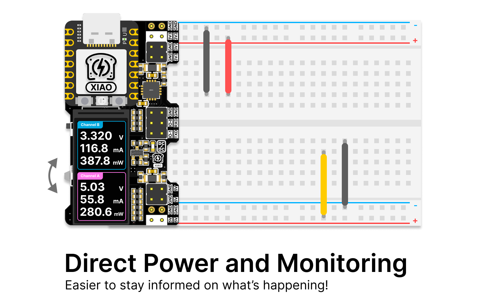
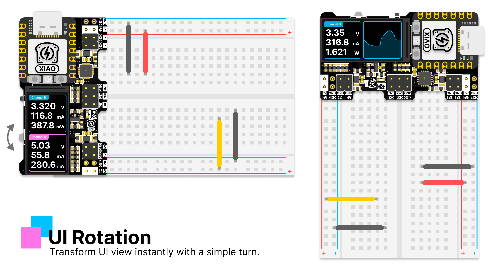

# XIAO PowerBread - リアルタイムモニタリング機能付きブレッドボード電源供給装置

[English](README.md) | [Deutsch](README_DE.md) | [Français](README_FR.md) | 日本語

**XIAO PowerBread**は、ブレッドボードプロトタイピング用の信頼性の高い効率的な電源ソリューションを提供するオープンソースハードウェアプロジェクトです。内蔵センサー、リアルタイムモニタリング、RP2040マイクロコントローラーを搭載し、PowerBreadは電子プロジェクトの電源供給と開発をこれまで以上に容易にします。

> 簡単な設置とコンパクトな設計

> ブレッドボードプロジェクトへの直接電源供給とモニタリング

## 主な特徴

1. **リアルタイムモニタリング**: マルチメーター不要で重要な電源メトリクスを一目で確認。内蔵ディスプレイにリアルタイムの電圧、電流、電力データを表示。
2. **高電流出力**: 最大1.5Aの3.3V電源を供給。ほとんどのブレッドボ��ドベースの電子プロジェクトに最適。
3. **内蔵LCDディスプレイ**: リアルタイムフィードバックで常に情報を把握。重要な電源データが内蔵LCDに明確に表示されます。
4. **プラグアンドプレイ設計**: 標準的なブレッドボードと互換性があり、追加設定なしで簡単に接続、電源投入、プロトタイピングが可能。
5. **オープンソースとRP2040搭載**: RP2040を搭載したオープンソース設計により、USB-シリアル通信やPWM制御などの将来の拡張に柔軟性を提供。
6. **デュアルチャンネル電圧・電流センシング**: INA3221センサーを搭載し、デュアルチャンネルの電圧・電流モニタリングが可能。電源供給のあらゆる側面を把握できます。
7. **コンパクトなパワーハウス**: このコンパクトな設計で3.3Vと5Vの出力を提供し、電力を犠牲にすることなくブレッドボードのスペースを最適化。
8. **複数のUI機能**: UIはデータモニタリング、ラインチャート、統計モードの間で切り替え可能。

> 複数のUI機能

> ダイヤルを長押しして、チャートモードと統計モードでチャ���ネルを切り替え

> ダイヤルを回転させて、異なる視角に合わせてUIを調整

## ハードウェア仕様

- **入力電圧**: XIAOを介してUSB-Cから電源供給。
- **出力電圧**: 5Vと3.3Vの出力を提供。3.3Vレールの最大電流は1.5A。
- **電流センシング**: 内蔵INA3221センサーが電圧、電流、電力を測定し、リアルタイム表示。
- **マイクロコントローラー**: RP2040搭載。センサーデータの処理、ディスプレイ制御を行い、将来的にUSB-シリアル通信やPWM生成などの機能を可能に。
- **ディスプレイ**: リアルタイム電源モニタリング用のLCD画面。
- **PCBサイズ**: 標準的なブレッドボードとシームレスに統合できるよう設計され、スペース使用を最小限に抑えています。

## はじめに

### ハードウェア

- **XIAOボード**: XIAO RP2040を推奨。他のXIAOボードも動作するはずです（未テスト）。
- **XIAO PowerBreadボード**: このリポジトリからデザインをクローンまたはリミックス。また、[Tindie](https://www.tindie.com/products/35842/)からハードウェアを入手することもできます。
- **ブレッドボード**: 簡単なプロトタイピングのため、標準的なブレッドボードに適合。
- **電源**: 標準的なUSB電源を使用。

### ソフトウェア

- **プロジェクトのリミックス**: 提供されているArduinoソースコードを使用してプロジェクトを変更またはリミックス。
- **コンパイル済みファームウェアを直接使用**: 現在、コードはXIAO RP2040でのみテストされています。XIAO RP2040にファームウェアをアップロードするにはUF2方式を使用することをお勧めします。

> UF2アップロード方法:
> 1. [リリースページ](https://github.com/nicho810/XIAO-PowerBread/releases)からコンパイル済みファームウェアファイルをダウンロード
> 2. XIAOをUSB経由でPC/MACに接続（4ピンUSBケーブルであることを確認）
> 3. XIAOのB(Boot)ボタンを押し**続けながら**、同時にXIAOのR(Reset)ボタンを押します。その後、すべてのボタンを離します
> 4. PC/MACにRPI-RP2という名前のUSBドライブが表示されるはずです
> 5. ファームウェアファイル(*.uf2)をRPI-RP2ドライブにドラッグ＆ドロップすると、ファイルがXIAOにアップロードされます
> 6. 数秒後、XIAOはリセットされ、ファームウェアで起動します

### 計画中のソフトウェア機能
- [x] LCDにリアルタイムの電流センサーデータを表示
- [x] 異なる視角に合わせてUIを調整するダイヤルホイール
- [x] 各チャンネルの電力使用を視覚化するラインチャートモード
- [x] 各チャンネルの平均（秒、分、全時間）とピーク電流消費をカウントするカウントモード
- [x] 設定データをEEPROMに保存可能
- [ ] デバッグツールとしてのUSB-シリアルモード
- [ ] IO0とIO1でのPWM出力
- [ ] IO0とIO1からのADC読み取り

### ファームウェアリリース

| バージョン | 安定版 | 開発版 | 追加された機能 | リンク |
|---------|---------|---------|---------|---------|
| 0.9.0     | はい | はい | LCDにリアルタイムの電流センサーデータを表示 | - |
| 1.0.0     | はい | はい | 異なる視角に合わせてUIを調整するダイヤルホイール | [リリースページ](https://github.com/nicho810/XIAO-PowerBread/releases/tag/v1.0.0) |
| 1.1.0     | いいえ | はい | 各チャンネルの電力使用を視覚化するラインチャートモード | [リリースページ](https://github.com/nicho810/XIAO-PowerBread/releases/tag/v1.1.0) |
| 1.1.1     | はい | はい | データダッシュボード、ラインチャート、電流統計、設定をサポート | [リリースページ](https://github.com/nicho810/XIAO-PowerBread/releases/tag/v1.1.1) |
| 1.1.2     | はい | はい | デバッグ目的のLED点滅機能を導入 | [リリースページ](https://github.com/nicho810/XIAO-PowerBread/releases/tag/v1.1.2) |
| 1.1.3     | はい👍 | はい | ラインチャートの固定スケールと自動スケールのサポートを追加 | [リリースページ](https://github.com/nicho810/XIAO-PowerBread/releases/tag/v1.1.3) |

### トラブルシューティング
1. ディスプレイが反応しない
   - 最新のファームウェアを使用していることを確認してください。最新のファームウェアには安定性のためのバグ修正が含まれています。
   - XIAOボードのリセットボタンを押してリセットしてみてください。
2. ディスプレイが動作しない
   - XIAOの赤いLEDが点滅している場合、INA3221が正しく接続されていないことを意味します。I2Cピンの接続を確認してください。
   - XIAOの赤いLEDが点滅していない場合、ディスプレイが正しく駆動されていないことを意味します。SPIピンの接続を確認してください。
3. 電流値が正しくない
   - シャント抵抗の値を確認し、sysConfigで正しく設定してください。（例：20mΩの場合は20、50mΩの場合は50） -> [システム設定の説明](Docs/sysConfig.md)
4. 両方の電圧がディスプレイで0Vと表示される
   - 電源スイッチを確認してください。下側にあるべきです。（上側がOFF、下側がON）

### ドキュメンテーション
- [システム設定の説明](Docs/sysConfig.md)
  - デフォルトモード設定
  - シャント抵抗設定（20mΩ、50mΩ）
  - シリアル出力設定（人間可読モード、Arduinoプロッターモード）
  - ラインチャート設定���チャート更新レート）

### 使用ライブラリ
- [INA3221_RT ライブラリ](https://github.com/RobTillaart/INA3221_RT/tree/master)
- [Adafruit GFX ライブラリ](https://github.com/adafruit/Adafruit-GFX-Library)
- [Adafruit ST7735 ライブラリ](https://github.com/adafruit/Adafruit-ST7735-Library)
- [Arduino-Pico Core (4.0.x)](https://github.com/earlephilhower/arduino-pico)
- [adafruit sleepydog](https://github.com/adafruit/Adafruit_SleepyDog)

> v1.1.2以降、このプロジェクトで使用されているLCDモジュールに適合するように修正されたAdafruit_ST7735ライブラリのバージョンが含まれています。

## 貢献

XIAO PowerBreadプロジェクトの改善に貢献を歓迎します！プルリクエストの提出、新機能の提案、バグの報告など、イシュートラッカーを自由にご利用ください。

## ライセンス

このプロジェクトはMITライセンスの下でライセンスされています。詳細は[LICENSE](./LICENSE)ファイルをご覧ください。